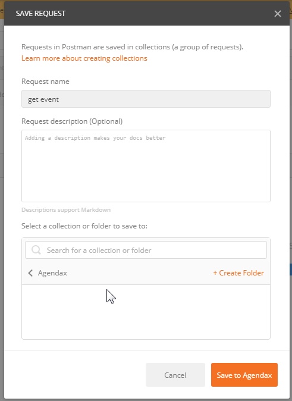
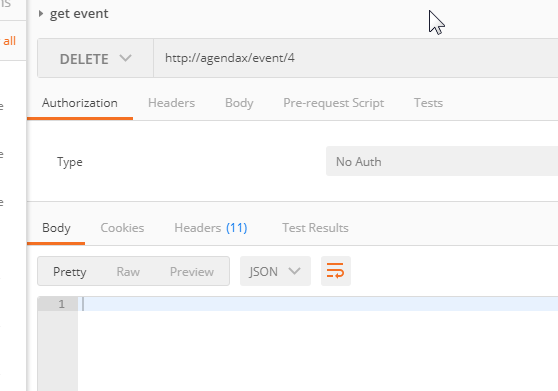
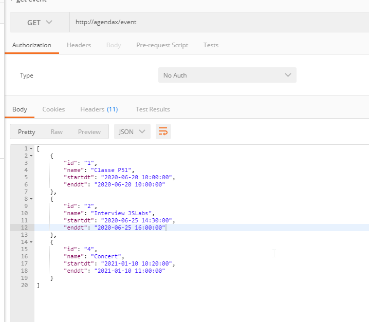
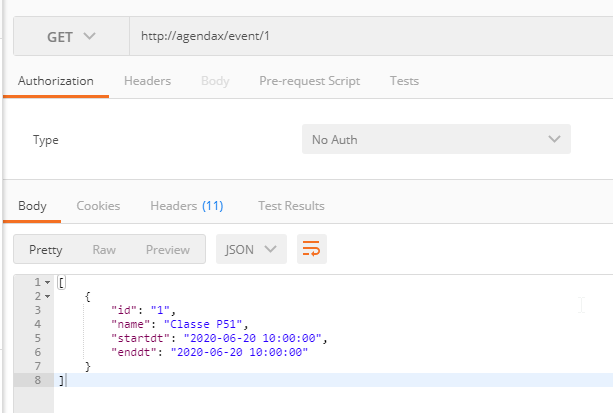
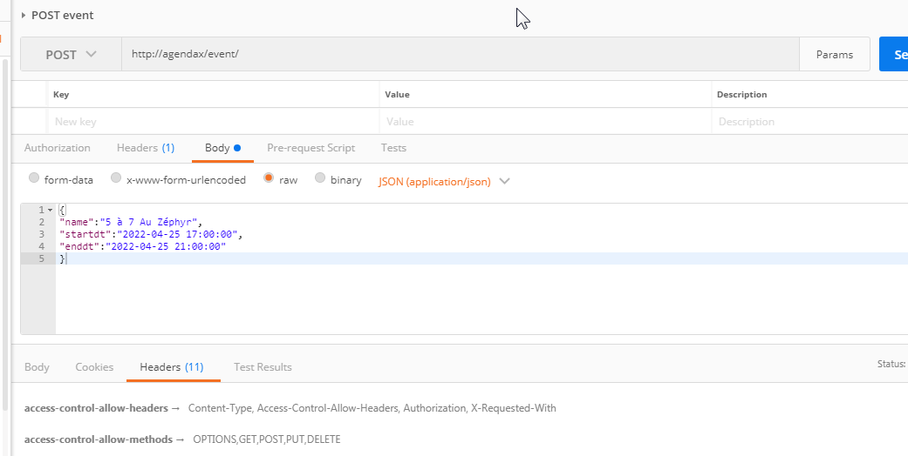

# agendax

## Présentation

Base de projet pour le TP 582-P51-MA, Prog. Inter. C/S, gr.17612

Deux parties:
1. Sous-dossier **api**:  API back-end (sans interface HM), inspirée de [Build a Simple REST API in PHP](https://developer.okta.com/blog/2019/03/08/simple-rest-api-php)
1. Sous-dossier **fe**: Partie front-end

## Back-end (API)

### Composants

* [Composer](https://getcomposer.org/) pour la gestion des packages externes.
* Produits tiers utilisés:
    * [PHP dotenv](https://github.com/vlucas/phpdotenv) pour la gestion des variable d'environnement (fichiers `.env` et `.env.example`)
    * [PHPUnit](https://phpunit.de/getting-started/phpunit-9.html), pas utilisé présentement

Après l'installation de Composer, lancez `composer install` depuis une fenêtre terminal (`composer update` pour d'éventuelles mises-à-jour).

### Variabes d'environnement

Adaptez votre propre version du fichier `.env` notamment pour y placez vos paramètres de DB.

### Database

À remanier à votre goût.

* Nom: agendax
* Tables(1):
    * `agxevent`: Les événements (le nom event est refusé par mysql)

Fichier `dbseed.php` pour pré-remplir la base de données (fixture) et faire quelques appels directs à l'objet Model\Event

### API

Prise en charge par le controler Controller\EventController. 

Voici les requêtes implantées:

* `GET /event`: Renvoie tous les événements
* `GET /event/{id}`: Renvoie un événement
* `POST /event`: Ajoute un événement
* `PUT /event/{id}`: Met à jour un événement
* `DELETE /event/{id}`: Supprime un événement

API testée avec l'extension Chrome [Postman](https://chrome.google.com/webstore/detail/postman/fhbjgbiflinjbdggehcddcbncdddomop?hl=fr). Voir les copies d'écran dans le répertoire doc.

### .htaccess

Il permet de rediriger toutes les requêtes vers public/index.php

## Front-end
